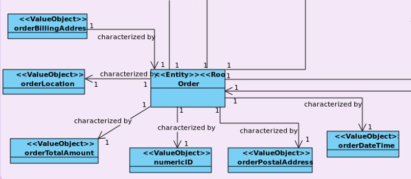
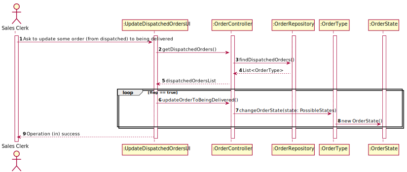

## US1006 - As Sales Clerk, I want to access a list of orders that had been dispatched for customer delivery and be able to update some of those orders to as being delivered. 

# Requisitos

## 1.1 Interpretação de Requisitos
**US1006** As Sales Clerk, I want to access a list of orders that had been dispatched for customer delivery and be able to update some of those orders to as being delivered. 

* US1006.1 * Get a list of orders whose state is defined as "Dispatched"
* US1006.2 * Allow Sales Clerk to choose specific order to change its state
* US1006.3 * Change specified order state to "Being Delivered"

# 2. Análise

## 2.1 Identificação de conceitos

* **[Entity] OrderType**
    * [ValueObject] OrderID
    * [ValueObject] OrderBillingAddress
    * [ValueObject] OrderLocation
    * [ValueObject] OrderTotalAmount
    * [ValueObject] OrderPostalAddress
    * [ValueObject] OrderDateTime
    * [ValueObject] OrderState

## 2.2 Invariantes / Regras de negócio

OrderType:

- OrderID -
    * Not empty numeric code
- OrderBillingAddress -
    * Not empty having 100 chars maximum;
- OrderLocation -
    * Not empty having 100 chars maximum;
- OrderTotalAmount -
    * It must be a positive non-zero number
- OrderPostalAddress -
    * Not empty having 100 chars maximum;
- OrderDateTime -
    * It must have the time and date of when the task was created
- OrderState -
    * It must have one of the three possible state options

## 2.3 Modelação da Funcionalidade

# 3. Design

## 3.1 Realização da Funcionalidade

### 3.1.1 Diagrama de Sequência

## 3.2 Diagrama de Classes

In the analysis phase, the domain concepts (Entities, ValueObjects, etc.) associated with this functionality have already been identified. All these concepts will be represented by respective classes, and are therefore a fundamental part of this functionality.

However, several other classes were identified, which, despite not being domain concepts, are also fundamental to this User Story.

**_Presentation Layer_**

UI - The User Interface, which leads to the User Story and interacts with the user.

**_Application Layer_**

Controller - The User Story controller that delegates tasks to other classes.

**_Domain Layer_**

All classes referring to concepts identified in the analysis phase:

OrderType
OrderID
OrderBillingAddress
OrderLocation
OrderTotalAmount
OrderPostalAddress
OrderDateTime
OrderState
PossibleStates

**_Persistence Layer_**

Repositories have the objective of taking care of the persistence of the modified data during the use of the application's functionalities, and the collection of this same data when necessary

## 3.3. Padrões Aplicados

### 3.3.1 Information Expert

* Information Expert
* The class OrderType knows their attributes the best, so it is responsible by their verification and validation

### 3.3.2 Tell, don't ask

* Tell, don't ask
* The Controller, instead of asking, tells other classes what to do

### 3.3.3 Single Responsability Principle

* Single Responsability Principle
    * The UI's main purpose is to interact with the user. Each class has only one responsibility.

