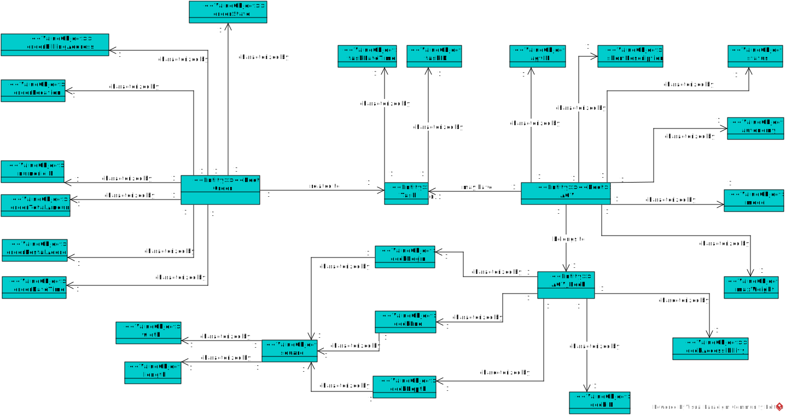
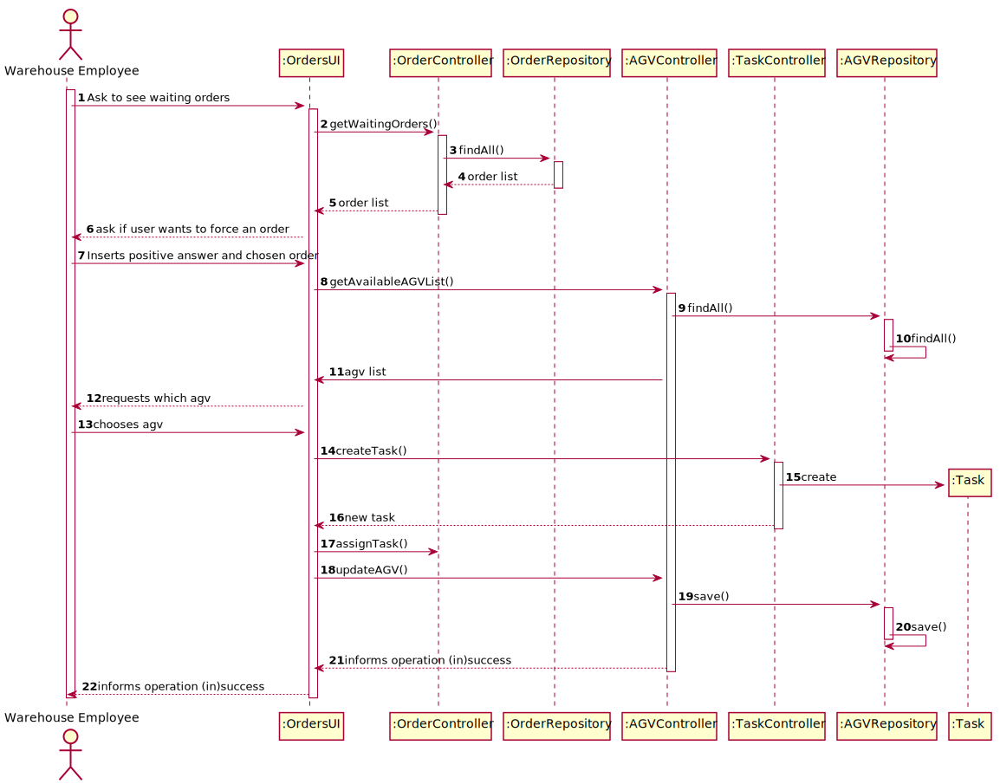

## US2003 - As Warehouse Employee, I want to access the list of orders that need to be prepared by an AGV and be able to ask/force any of those orders to be immediately prepared by an AGV available.
=======================================

# 1. Requisitos

## 1.1 Interpretação dos Requisitos
**US2003.** As Warehouse Employee, I want to access the list of orders that need to be prepared by an AGV and be able to ask/force any of those orders to be immediately prepared by an AGV available.

* US2003.1* Get list of orders waiting to be prepared by an AGV
* US2003.2* Force order to start being prepared by an available AGV

# 2. Análise

## 2.1 Identificação de conceitos

* **[Entity] AGV**
    * [ValueObject] AGVIdentification
    * [ValueObject] Autonomy
    * [ValueObject] MaxWeight
    * [ValueObject] Model
    * [ValueObject] ShortDescription
    * [ValueObject] Status
    * [Entity] AGVDock
    * [Entity] Task

* **[Entity] AgvDock**
    * [ValueObject] beginSquare
    * [ValueObject] endSquare
    * [ValueObject] depthSquare
    * [ValueObject] accessibility
    * [Entity] AGV

* **[Entity] Task**
    * [ValueObject] TaskID
    * [ValueObject] TaskDateTime
    * [Entity] OrderType
    * [Entity] AGV

* **[Entity] OrderType**
    * [ValueObject] OrderID
    * [ValueObject] OrderBillingAddress
    * [ValueObject] OrderLocation
    * [ValueObject] OrderTotalAmount
    * [ValueObject] OrderPostalAddress
    * [ValueObject] OrderDateTime
    * [ValueObject] OrderState
    * [Entity] Task

## 2.2 Invariantes/Regras de negócio

AGV Features:

- Identification -
  * Not empty alphanumeric code with at 8 chars maximum
- Autonomy -
  * It must be a positive non-zero number
- MaxWeigth -
  * It must be a positive non-zero number
- Model -
  * Not empty having 50 chars maximum;
- ShortDescription -
  * Not empty having 30 chars maximum;
- AgvDocks -
  * It must have 1 AgvDock

AGVDock Features:

- BeginSquare -
  * It must not be intersecting an existing object in the warehouse, and it must be inside the warehouse
- EndSquare -
  * It must not be intersecting an existing object in the warehouse, and it must be inside the warehouse
- DepthSquare -
  * It must not be intersecting an existing object in the warehouse, and it must be inside the warehouse
- Accessibility -
  * It must be characterized by two characters, the first on being 'l' or 'w' representing "length" or "width" respectively, the second character must be a '-' or a '+', representing the direction of the accessibility

Task Features:

- TaskID -
  * Not empty numeric code
- TaskDateTime -
  * It must have the time and date of when the task was created
- OrderType -
- * It must have 1 Order
- AGV -
  * It must have 1 AGV

OrderType:

- OrderID -
  * Not empty numeric code
- OrderBillingAddress -
  * Not empty having 100 chars maximum;
- OrderLocation -
  * Not empty having 100 chars maximum;
- OrderTotalAmount -
  * It must be a positive non-zero number
- OrderPostalAddress -
  * Not empty having 100 chars maximum;
- OrderDateTime -
  * It must have the time and date of when the task was created
- OrderState -
  * It must have one of the three possible state options

## 2.3 Modelação no Modelo de Domínio

# 3. Design

## 3.1. Realização da Funcionalidade

### _3.1.1 Diagrama Genérico_

## 3.2. Diagrama de Classes

In the analysis phase, the domain concepts (Entities, ValueObjects, etc.) associated with this functionality have already been identified. All these concepts will be represented by respective classes, and are therefore a fundamental part of this functionality.

However, several other classes were identified, which, despite not being domain concepts, are also fundamental to this User Story.

**_Presentation Layer_**

UI - The User Interface, which leads to the User Story and interacts with the user.

**_Application Layer_**

Controller - The User Story controller that delegates tasks to other classes.

**_Domain Layer_**

All classes referring to concepts identified in the analysis phase:
Task
TaskID
TaskDateTime
OrderType
OrderID
OrderBillingAddress
OrderLocation
OrderTotalAmount
OrderPostalAddress
OrderDateTime
OrderState
AGV

**_Persistence Layer_**

Repositories have the objective of taking care of the persistence of the modified data during the use of the application's functionalities, and the collection of this same data when necessary

## 3.3. Padrões Aplicados

### 3.3.1 Information Expert

* Information Expert
 * The class Task/Order knows their attributes the best, so it is responsible by their verification and validation

### 3.3.2 Tell, don't ask

* Tell, don't ask
 * The Controller, instead of asking, tells other classes what to do
### 3.3.3 Single Responsability Principle

* Single Responsability Principle
  * The UI's main purpose is to interact with the user. Each class has only one responsibility. 
## 3.4. Testes

### 3.4.1 Testes Verificação

**Test 1:** Verify if chosen AGV exists

**Test 2:** Verify if chosen Order exists

### 3.4.2 Testes Validação
**Test 1:** Check if chosen AGV is available

**Test 2:** Verify if chosen Order is waiting to be processed

