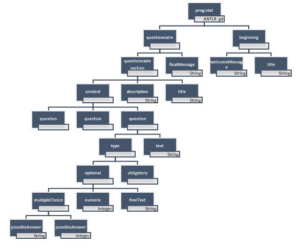

## US3000 - Specify new grammar
=======================================

# 1. Requirements

## 1.1 Interpretation of Requirements

- As Project Manager, I want the team to specify a grammar allowing to express several kinds of questionnaires.
- 
- The grammar should be conceived having in mind its reusability/applicability on other application domains than the one of this project (e.g., pedagogical questionnaires).

- The development team is requested to conceive/design/implement a generic base solution
that can be easily reused on other systems/domains

- No template will be provided, teams are free to adopt the format foreseen as best suitable
for the project purposes

  
# 2. Analysis

## 2.1 Identification of concepts

## 2.2 Modeling in the Domain Model

# 3. Design

## 3.1 Functionality

### _3.1.1 Generic Diagram_

## 3.2. Class Diagram

## 3.3. Applied Patterns

## 3.4. Tests
