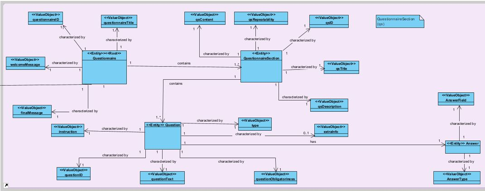
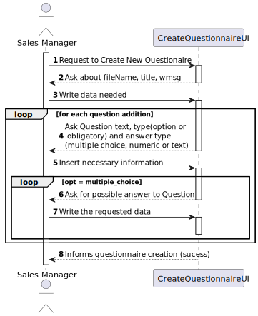

## US3001 - Create New Questionaire
=======================================

# 1. Requirements

**US3001.** As Sales Manager, I want to create a new questionnaire to be further answered by 
customers meeting the specified criteria (e.g.: have ordered a given product; 
belong to a given age group).

The set of questions/answers composing the questionnaire should be expressed 
and validated (parsed) using the grammar being developed for this purpose.

## 1.1 Interpretation of Requirements

### From the specifications document:

- A distinctive aspect of the SPOMS concerns its intrinsic ability to conduct surveys about
  a product or a brand or the customers’ satisfaction or even about any other topic
  that a sales manager intends to.

- In this respect, the generic solution must focus on the following aspects:
  (i) the specification of a questionnaire to be answered by the target audience;
  (ii) the ability to generate dynamically (at runtime) a proper user interface (UI) for any given questionnaire;
  (iii) to validate a given questionnaire response in accordance with the questionnaire specification;

- A questionnaire is a set of questions organized into one or more sections (i.e., a group of 
questions). Each question is of a certain type (e.g.: free text, multiple choices, 
ordering/ranking choices) which constraints the information to be requested.

- Yet, it is worth considering that a questionnaire might have mandatory and 
optional sections/questions and that some sections/questions might become mandatory/optional 
depending on the answer given to a previous question.

### From the Client clarifications:

- Creating a surveys has two distinct set of data:

Alphanumeric code, a description, the period (in days) it will be performed and 
a set of rules that allows the system to determine the survey target audience;

The intended questionnaire, i.e. the title, the welcome message, sections and questions.

- There is no need to import/export data.

- If a question is "mandatory", it means the user needs to answer such question no 
matter what is stated at the section it appears on.

- If a question is "optional", it means that is up to the user to answer or not the
question no matter what is stated at the section it appears on.

- Teams must adopt common-sense when applying other criteria such as min/max chars
length and support/explain the rationale taken.

  
# 2. Analysis

## 2.1 Modeling in the Domain Model

## 2.2 Business Invariants/Rules

## 2.3 Identification of concepts

# 3. Design

## 3.1 Functionality

### _3.1.1 Generic Diagram_

## 3.2. Class Diagram

## 3.3. Applied Patterns

### 3.3.1 Tell, don't ask

* Tell, don't ask
  *The Controller, instead of asking (ask) information from other classes and executing business logic, just tells (tell) the classes best suited for the task what it wants.

### 3.3.2 Single Responsability Principle

* Single Responsability Principle
  * The fundamental function of the UI class is to interact with the user. In other words, each class has only the fundamental responsibility that it has.

### 3.3.3 Service

### 3.3.4 Factories

## 3.4. Tests
