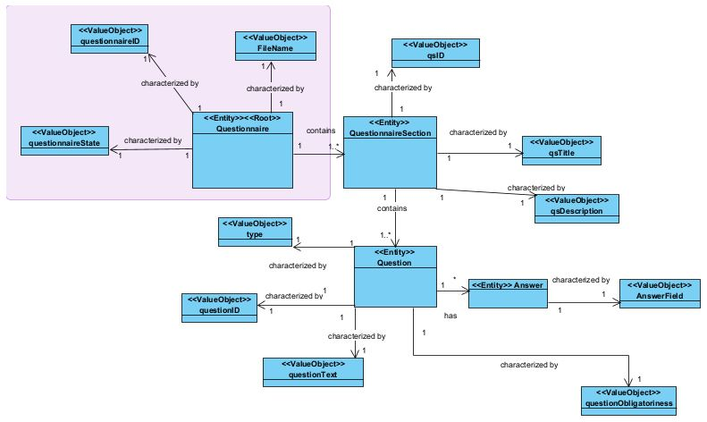
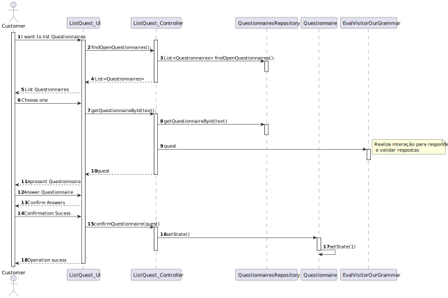

## US3501 - As Customer, I want to get the list of questionnaires that the system is asking me to answer and be able to answer any of those questionnaires.
=======================================

# 1. Requirements

**US3501.** As Customer, I want to get the list of questionnaires that the system is
asking me to answer and be able to answer any of those questionnaires.

* US3501.1 Notice that the UI should be generated dynamically in accordance to the
given questionnaire. UI is generated by interpreting the input questionnaire.

* US3501.2 The answers should be saved in a raw text format to be further 
processed/analyzed.

## 1.1 Interpretation of Requirements

Based on the information provided by the customer, on the set of user stories requested
by the same for this Sprint D, on the discussion of the requirements with the
customer himself in the appropriate forum, as well as the other members of the 
work team, this user story of the as follows:

* A distinctive aspect of the SPOMS concerns its intrinsic ability to conduct surveys about a product or
  a brand or the customers’ satisfaction or even about any other topic that a sales manager intends to.
  Since, nowadays, this is seen as a common and recurrent feature in a huge variety of systems, the
  development team is requested to conceive/design/implement a generic base solution that can be
  easily reused on other systems/domains. 

* In this respect, the generic solution must focus on the following aspects: 

*** (i) the specification of a questionnaire to be answered by the target audience; 

*** (ii) the ability to generate dynamically (at runtime) a proper user interface (UI) for any given
  questionnaire; 

*** (iii) to validate a given questionnaire response in accordance with the questionnaire
  specification;

*** (iv) to provide a statistical report given a set of responses to a given questionnaire.
  Other aspects such as the data/information persistence and the distribution of the questionnaire by
  the target audiences can become dependent of the target system (e.g.: SPOMS).

Regarding "an option to answer later", do not turn the easy things more complex than it is really needed.
  

* The "relationship" between the questionnaire and customers is somehow established
  when creating the questionnaire (US 3001), namely when the user is specifying the criteria that
  target customers must met (e.g.: have ordered a given product; belong to a given age group).

### Client Clarifications

***Question*** Can a customer answer the same survey multiple times?
Or should he only be able to answer the survey once?

***Answer*** No!

---------------------------------------------------------------

***Question*** The defined architecture for the product indicates that requests from the 
Customer App to the Database must go through the Orders Server. As such, I was wondering 
if the same applies when the Customer App needs the Surveys to show to the customers,
that is, if the Customer App can or not directly communicate with the Database to request
the surveys or if the surveys need to come from the Orders Server. I assume that it is the
second option, but just to make sure.

***Answer*** The specifications' document states (page 10):
A direct connection to the database (graphically depicted on red) must be avoid.
Instead, data requests should be made through the “Orders API” exposed by the “Orders Server” component.
A server application, called “Orders Server”, responsible to fulfill the all 
the data requests necessary to the “Customer Application” works properly.
As so, I believe there is no reason to your doubt.

---------------------------------------------------------------

***Question*** Question [1]: In regard to the survey rules, can a survey have multiple of them?
Question [2]: If multiple rules were chosen for a given survey, would these be used in 
conjunction or disjunction?

***Answer*** Q1 and Q2: It would be nice to specify more than one condition in
the same rule and have more than one rule.

Example:
  Rule 1 (two conditions): "Having ordered a certain product (C1) and be of a certain gender (C2)".
  Rule 2 (one condition): "Living in Porto district".

The target customers would be the ones meeting Rule 1 or Rule 2.
So, you have conjunction inside a rule (C1 and C2) and disjunction between rules (R1 or R2).
At the end of Sprint D, at least one scenario (conjunction or disjunction) must be supported.

---------------------------------------------------------------

***Question*** How should the surveys be distributed to the Customers?
Should it be through the orders api?

***Answer*** All communications must be in conformity with the Figure 2 
content of the specifications' document.
Be aware that the connection depicted on red must be avoided.

---------------------------------------------------------------

***Question*** When showing the questionnaire questions and asking for the awnsers
to the costumer, should we use a graphical interface or the command line?

***Answer*** The customer is using a "console application" as stated in the specifications' document.
When a non-console UI is required, that is being requested explicitly (e.g. US 2005), 
which is NOT the case of US 3501. As so, a console UI is enough.

---------------------------------------------------------------

# 2. Analyze

## 2.1 Identification of concepts

* [Entity] **Questionnaire**
   * [ValueObject] FileName
   * [ValueObject] QuestionnaireID
   * [ValueObject] QuestionnaireState
   * [ValueObject] QuestionnaireTxt

**Grammar Concepts**

  - EvalVisitorOurGrammar
  - OurGrammar
  - OurGrammarBaseListener
  - OurGrammarBaseVisitor
  - OurGrammarLexer
  - OurGrammarListener
  - OurGrammarParser
  - OurGrammarVisitor

## 2.2 Modeling in the Domain Model

By comparing the analysis made in this section with the modeling done in the 
Domain Model previously, it was concluded that the Domain Model is able to
respond to the client's requirements for this User Story.

# 3. Design

## 3.1. Realização da Funcionalidade

According to the analysis carried out previously, and the client's requirements,
it is possible to conclude that the requested functionality is relevant in the
development of our system, so it is really important that all the details of it
are well specified.

As such, we chose to represent how this functionality works in the form of a
generic UML Diagram.

### _3.1.1 Generic Diagram_

## 3.2. Applied Patterns

I considered three patterns that are interconnected, and were always kept in mind during Design, so they were applied in different contexts.

### 3.2.1 Information Expert

* Information Expert
   * The Customer class is the one who knows its attributes best, so it is the most suitable class to carry out verification of its attributes according to the data received.
  
### 3.2.2 Tell, don't ask

* Tell, don't ask
   *The Controller, instead of asking (ask) information from other classes and executing business logic, just tells (tell) the classes best suited for the task what it wants.

### 3.2.3 Single Responsability Principle

* Single Responsability Principle
   * The fundamental function of the UI class is to interact with the user. In other words, each class has only the fundamental responsibility that it has.

### 3.2.4 Repository

* Repositories are classes or components that encapsulate the logic required to access data sources.

### 3.2.5 Creator

## 3.3. Tests

In order to successfully carry out this functionality, it is extremely necessary to verify if it is suitable and therefore creating tests becomes essential.  

Therefore, in order to comply with the parameters and acceptance criteria of this use case, the following tests were created:

Test 1:

Test 2:

Test 3:

