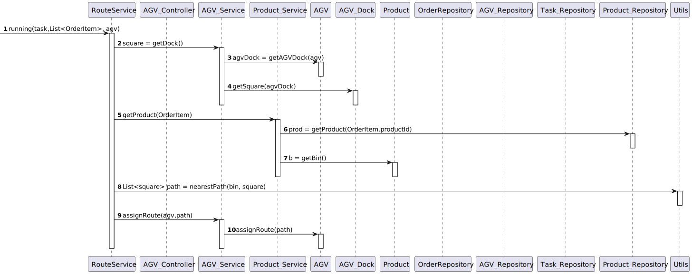

## US5100 - As Project Manager, I want that the team to develop and integrate the others components/parts of the AGV digital twin 
(e.g.: movement, obstacle sensors, control unit).
=======================================

# 1. Requirements

**US5100.** As Project Manager, I want that the team to develop and integrate the 
others components/parts of the AGV digital twin (e.g.: movement, obstacle 
sensors, control unit).

* US5100.1 In conformity with SCOMP guidelines.

## 1.1 Interpretation of Requirements

Based on the information provided by the customer, on the set of user stories requested
by the same for this Sprint D, on the discussion of the requirements with the
customer himself in the appropriate forum, as well as the other members of the 
work team, this user story of the as follows:

### Client Clarifications

***Question*** Q: If two AGVs are 1 square close to each other, they must stop,
but what needs to be done next? Create a new route to take the assigned task?
And if an AGV passes one block away from another and never collides, should we
ignore the "AGV must stop" sentence, or should he stop the AGV and move the AGV
again?

***Answer*** The overall idea is to avoid collision between AGVs.
As so, the "must stop" aims to avoid an imminent collision.
In such case, new routes should be computed in order to complete
the task that in  each AGV has in hands. 
The strategy for that it is up to each team to decide.

---------------------------------------------------------------

***Question*** Dear Client, the statement says that an AGV has a total of 8 sensors,
2 in each corner of the AGV. Therefore, some doubts have arisen, such as:
What is the difference between having one or two sensors, in each corner? 
How do we differentiate between them? Are they in the same position?

***Answer*** Each sensor is a source of information to signal (or not) the presence
of an obstacle (e.g.: another AGV, an aisle, etc.).
In each corner there is a sensor to evaluate obstacles in the
front and another sensor  to evaluate obstacles on the side.
  
---------------------------------------------------------------

***Question*** [Q1]: Would all these AGV Digital Twin instances share
information about the different modules, to be aware of the presence of
other moving agvs?

[Q2]: At the level of representing the movement of agvs on the dashboard, 
developed in Sprint 3, how would the information about the movement of an 
agv be sent to the dashboard, for the dashboard to be able to demonstrate?

***Answer*** [Q1]: It is NOT foreseen that AGVs communicate between them. 
However, each AGV can by its own initiative communicate with the AGV Manager.
Notice that in your picture this possibility is not depicted. 
However, this possibility is depicted on Figure 2 of the specifications' document.

[Q2]: Your question is related to data/information flow. 
Such flow must be in accordance with Figure 2 of the specifications' document.
Notice that, the dashboard shows the current position of each AGV.
If the AGVs position is changing then by refreshing the dashboard is enough 
to show AGV movement.

---------------------------------------------------------------

# 2. Analyze

## 2.1 Identification of concepts

* [Entidade] **AGV**
   * [ValueObject] AGVAddress
   * [ValueObject] AGVIdentification
   * [ValueObject] Autonomy
   * [ValueObject] MaxWeight
   * [ValueObject] Model
   * [ValueObject] ShortDescription
   * [ValueObject] Status

  
* [Entidade] **AGVDocks**
    * [ValueObject] AGVDockIdentification
    * [ValueObject] Accessibility
    * [ValueObject] Begin (square)
    * [ValueObject] End (square)
    * [ValueObject] Depth (square)

* [Entidade] **Aisles**
  * [ValueObject] AisleIdentification
  * [ValueObject] Begin (square)
  * [ValueObject] End (square)
  * [ValueObject] Depth (square)
  * [ValueObject] Accessibility

* [Entidade] **Rows**
    * [ValueObject] RowID
    * [ValueObject] Begin (square)
    * [ValueObject] End (square)
    * [ValueObject] Depth (square)
    * [ValueObject] Shelves  

* [Entidade] **StorageArea**
  * [ValueObject] ID

* [Entidade] **Bin**
    * [ValueObject] BinID

## 2.2 Modeling in the Domain Model

By comparing the analysis made in this section with the modeling done in the 
Domain Model previously, it was concluded that the Domain Model is able to
respond to the client's requirements for this User Story.

# 3. Design

## 3.1. Realização da Funcionalidade

According to the analysis carried out previously, and the client's requirements,
it is possible to conclude that the requested functionality is relevant in the
development of our system, so it is really important that all the details of it
are well specified.

As such, we chose to represent how this functionality works in the form of a
generic UML Diagram.

### _3.1.1 Generic Diagram_

## 3.2. Applied Patterns

I considered three patterns that are interconnected, and were always kept in mind during Design, so they were applied in different contexts.

### 3.2.1 Information Expert

* Information Expert
   * The Customer class is the one who knows its attributes best, so it is the most suitable class to carry out verification of its attributes according to the data received.
  
### 3.2.2 Tell, don't ask

* Tell, don't ask
   *The Controller, instead of asking (ask) information from other classes and executing business logic, just tells (tell) the classes best suited for the task what it wants.

### 3.2.3 Single Responsability Principle

* Single Responsability Principle
   * The fundamental function of the UI class is to interact with the user. In other words, each class has only the fundamental responsibility that it has.

### 3.2.4 Repository

* Repositories are classes or components that encapsulate the logic required to access data sources.

### 3.2.5 Builder

* Builder is a creational design pattern that lets you construct complex objects step by step.
  
## 3.3. Tests

In order to carry out the functional tests of this use case, we will have to simulate the performance of tasks by several AGVs and verify confrontations and interceptable trajectories.